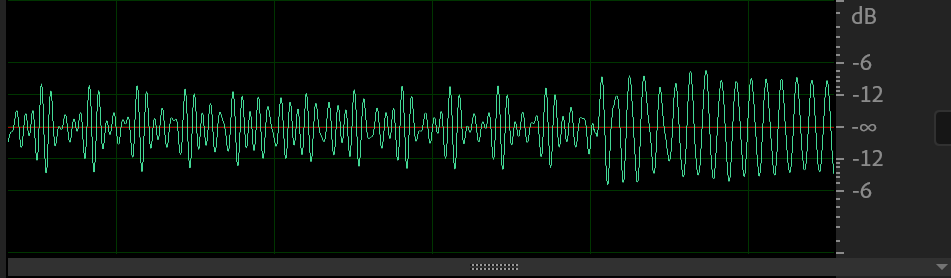
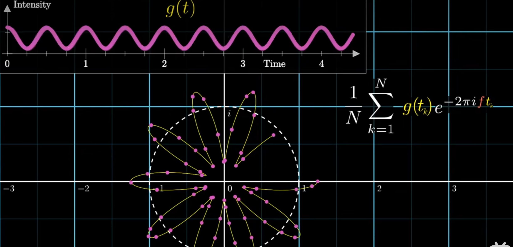
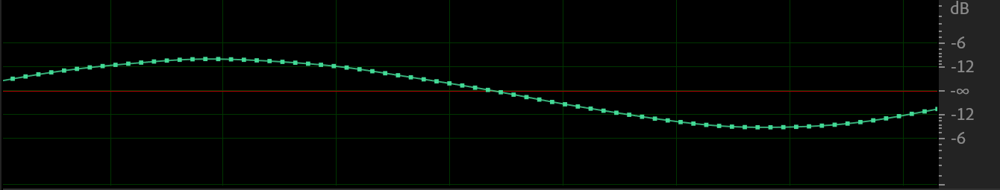
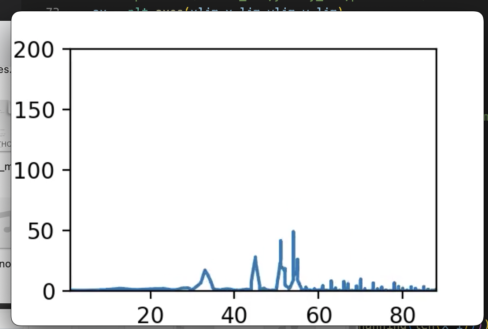
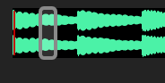
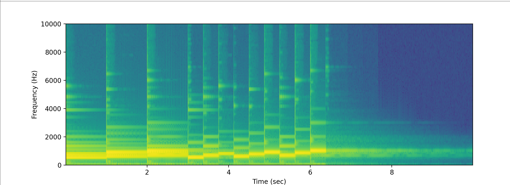

## 解析波的组合，只在于解析他们最高值与最低值的错位
这是一段十秒的钢琴录音。

横坐标为时间，纵坐标为强度(intensity)。
我们放大某一部分来看看，

会发现它实际上是频率在不同时间发生
我们想要知道这段声音的属性，比如它的音调组成、音量等。这就像反推混合好的颜色是由什么颜料组成一样。这个任务听起来十分困难，然而确实有这样的方法——**傅里叶变换** (Fourier Transform)
直观地讲,这个方法就是将音频的波形放在极坐标上绕了起来，

然后考察整个图像的中心（或者说重心）的位置。
【】

绕法不同，重心的位置不同。
【】

我们可以将所有这些绕法的结果记录下来。

得到的图叫做**频域图** (frequency domain)。
我们发现某些时候，图形的重心会发生很大偏离。这时的绕法刚好等于原来的波形的频率。图形上我们能直观感受到这个规律。
【】

我想是因为在这些时候，我们把原来的周期画进了单个的圆里。

而三角函数波在一个周期中经历最大和最小值，那么在绕圆的一圈中，波在远离圆心和接近圆心的方向发生了移动

总而言之，为了发现原来波形的频率组成，我们只需要把它绕起来，做傅里叶变换。然后图形

用数学来表述，就是
$$
F\left(\omega_{k}\right) \equiv \int_{-\infty}^{\infty} f(t) e^{-2 \pi i k t} \mathrm{~d} t, \quad k \in(-\infty, \infty)
$$

## 现实实现——离散傅里叶变换

我们继续把刚刚的波放大来看看

在计算机里，我们就是以这样的点来储存音频。我们将要使用的方法也变为**离散傅里叶变换**，Unlike the continuous version taught in mathematics lecture。
$$
\hat{f}_{k}=\sum_{j=0}^{n-1} f_{j} e^{-i 2 \pi j k / n}
$$
【animation explains the terms indexs】

我们把每一个k算出来（不同程度地将波形绕起来），得到了这一时刻周围的频率情况。

另外，在计算机里按这个式子来求解是昂贵的，我们常用一个叫快速傅里叶（FFT）的方法来显著提高计算速度，这个方法由xxx在xxx发现。此处不展开讨论。 

## 在时间里移动——短时傅里叶变换（STFT）
我们刚刚只分析了某一时刻，现在我们把不同时刻的都做出来，制成每一帧。
t=0.1s

t=0.2s

这是一个与时间有关的视角

注意到，如果我们对整段音频做傅里叶变换，我们将解析出丰富的频率。然而，我们不知道这些频率是什么时候发生的。

另外，我们在这里其实并不是直接把片段绕起来，而是先对它做了一点小处理后再绕起来的（对声波乘了一个函数），这是为了防止。。。

但不管怎么样，通过一个个小窗，我们就像是在全部的频率中按照时间把当时的频率滤了出来。
这也可以体现在频谱图上（spectuagram)

刚才频域图的高度在这就体现为这条竖线上的亮度（或颜色）。

【video of the result】