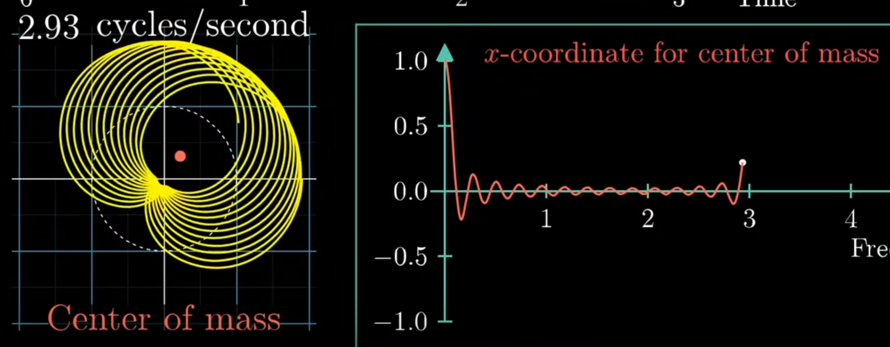
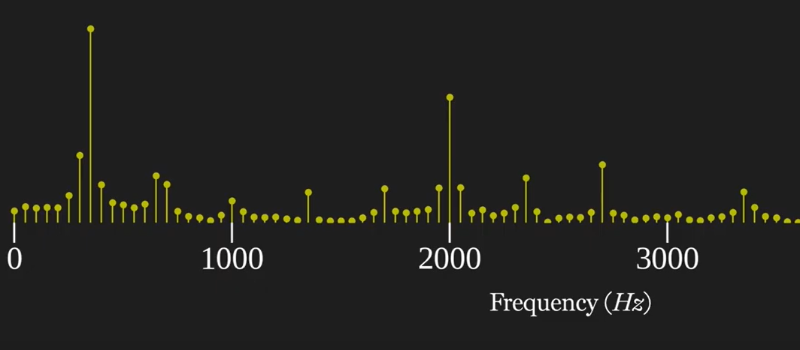
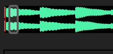

# Segment 1 Fourier Transform (continuous)
This is a ten second audio clip by piano.

The x-axis is for time, and y-axis is for intensity.
Let's zoom in a little bit, we see different frequencies happen through time.

Let's just focus on the left hand side part. They appear to be similarly repeated.

Actually, we know they are formed by sum of perfect sine or cosine waves. And the wave components can be solved by the **Fourier Transform**.
$$
F\left(\omega_{k}\right) \equiv \int_{-\infty}^{\infty} f(t) e^{-2 \pi i k t} \mathrm{~d} t, \quad k \in(-\infty, \infty)
$$
Intuitively, this method winds the wave around in circular ways, 
```
Animation:
indicate
```


then traces the CM of the resultant graph.

If we record all results of winding frequency about the position on of CM, we get the graph for **frequency domain**.



# Segment 2 DFT

However, if we really want to use it in practice, problems arise.

We never get continuous signals. Instead, we get discrete samples from the signal source.

If we continue to zoom in on our sound, we see these dots.

```
Animation
```

This is how we store the audio in computer. And we require the **discrete version of Fourier Transform**, 

Here is the formula for dicrete Fourier Transform.
```
Animation:
dot graph background
Text 'DFT' move to UL
show the formula
```
$$
\hat{f}_{k}=\sum_{j=0}^{n-1} f_{j} e^{-i 2 \pi k j / n}
$$
$$k=0,1,2,...,n-1$$

Let's see what the indexes mean and we will find it similar to our continuous version. 

We look at this with an example. Let's say we encounter a 30 Hz cosine sound wave. 
```
Animation:
Show the wave (sin(30*2pi*t)) t<=1
```
We assume 100Hz of sampling rate, meaning we would get 100 samples if we record one second. 
```
Animation:
the continuous -> discrete of the 30 Hz cosine wave. 

show the label for the dot (quickly)
```
And we actually sample for 0.1s, i.e we have 10 samples.


```
Animation:
n->9
```
We treat them as a vector.
```
Animation:
samples to vector,
vector move to right

```
Then, for k=2 for example, we apply the formula

$$
\left[\begin{array}{c}
\vdots \\
\vdots \\
\hat{f}_{2} \\
\vdots \\
\hat{\hat{f}}_{9}
\end{array}\right]=\left(\begin{array}{ccccc}
\cdots & \cdots & \cdots & \cdots & \cdots \\
\cdots & \cdots & \cdots & \cdots & \cdots \\
e^{-i 2 \pi(0) / N} & e^{-i 2 \pi(2) / N} & e^{-i 2 \pi(4) / N} & \cdots & e^{-i 2 \pi(2(N-1)) / N} \\
\vdots & \vdots & \vdots & \ddots & \vdots \\
\cdots & \cdots & \cdots & \cdots & \cdots
\end{array}\right)\left[\begin{array}{l}\
            f_{0} \\
            f_{1} \\
            f_{2} \\
            f_{3} \\
            f_{4} \\
            f_{5} \\
            f_{6} \\
            f_{7} \\
            f_{8} \\
            f_{9} \\
            \end{array}\right]
$$
```
Animation:
for j=0:9 
    Write e^{-2*pi*k*j/n} next to f_j,
    Draw this point on the polar co-ordinate system.
end;
Find center of mass on the graph;
Obtain and write f_bar_k on the left;
e^xxxxxxxx vertical, then move into the matrix here

```
What is the meaning of $\hat{f}_{2}$? Well, we see from animation that it is similar as continous version where we find the center of mass. But it is slightly different. We will go back to this later.

Now we continue the process for $k=0,1,...,9$.
```
Animation:
for all k : 
    write row k in the matrix, 
    plot 9 dots on the graph simultaniously, 
    find CM, 
    write f_hat_k
-> obtain a full matrix
```

$$
\left[\begin{array}{c}
\hat{f}_{0} \\
\hat{f}_{1} \\
\hat{f}_{2} \\
\vdots \\
\hat{\hat{f}}_{n-1}
\end{array}\right]=\left[\begin{array}{ccccc}
1 & 1 & 1 & \cdots & 1 \\
1 & w_{n} & \omega_{n}^{2} & \cdots & w_{n}^{n-1} \\
1 & w_{n}^{2} & w_{n}^{4} & \cdots & w_{n}^{2(n-1)} \\
\vdots & \vdots & \vdots & \cdots & \vdots \\
1 & w_{n-1}^{n-1} & w_{n}^{2(n-1)} & \cdots & w_{n}^{(n-1)^{2}}
\end{array}\right]\left[\begin{array}{l}
f_{0} \\
f_{1} \\
f_{2} \\
\vdots \\
\vdots \\
f_{n-1}
\end{array}\right]
$$

$$
\omega_{n}=e^{-2 \pi i / n} 
$$

Now we come back to the meaning of $\hat{f}_k$. $\hat{f}_2$/10 is the amplitute of (2)*(100/10)=20 Hz cosine wave.

Furthermore, we can plot the amplitute of $\hat{f}_k$'s. We obtain the graph of frequency domain.


We see that when k=3, the $\hat{f}_3$ is large, meaning that 3*(100/10)=30 Hz cosine wave is a large components of the signal.

Reason of k=0...,9. The largest possible component is...

# Segment 3: STFT
Notice that if we take the Fourier transform of the whole audio, we're going to extract a lot of frequencies. However, we do not know when these frequencies occur.

STFT do DFT on small segments of the original signal. So the results tell only freuencies around particular time. With this we get time information about the frequency.

```
Animation:
show a time window on the frame
then put the graph on the top of the screen
```

```
Animation:
zoom in on the time window (show the dots of the selected window)
show resultant freuency domain of this window

move window, repeat.
```

It is like scanning on the sound. As a result, we can draw the **spectrogram**.

For t=3s for example,


The height of the frequency domain graph is represented here by the brightness (or color) at a time.