# Segment 1 Fourier Transform (continuous)
This is a ten second audio clip by piano.
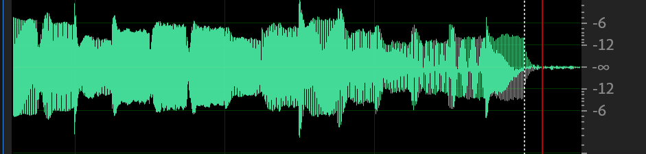
The x-axis is for time, and y-axis is for intensity.
Let's zoom in a little bit, we see different frequencies happen through time.
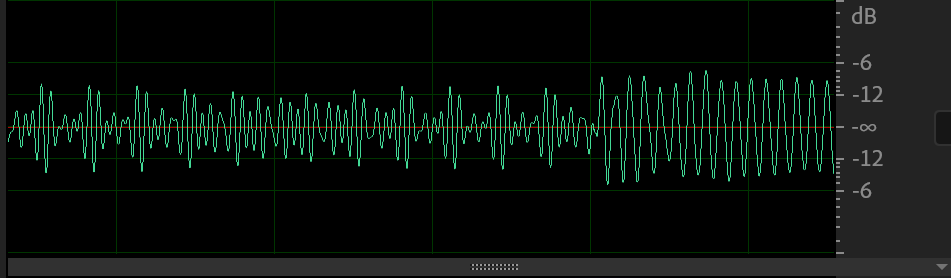
Let's just focus on the left hand side part. They appear to be similarly repeated.

Actually, it is known that they are formed by sum of perfect sine or cosine waves.
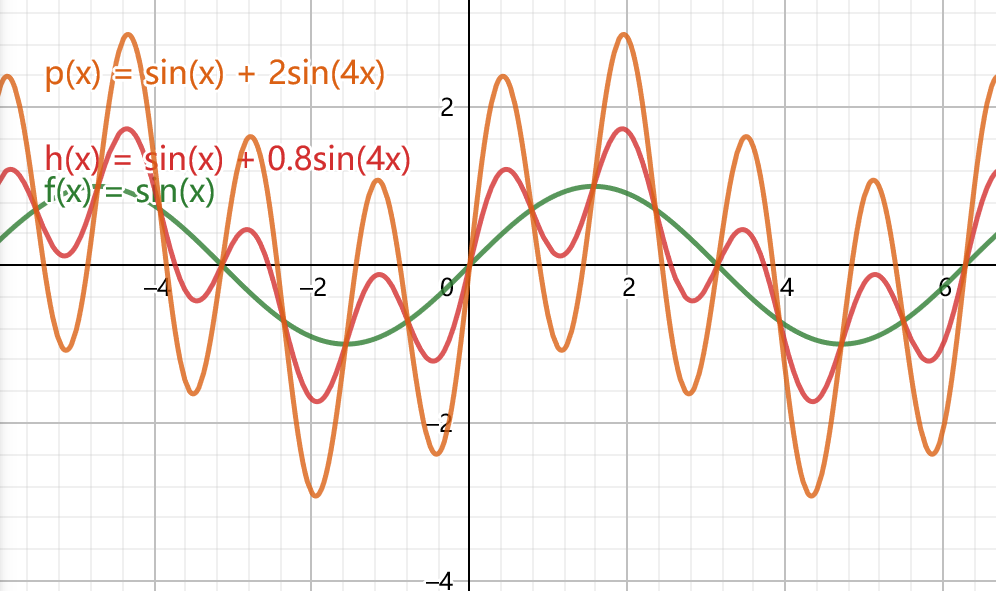
Suming them up looks like a wave in a wave. And if we remove the green one, the left orange (or red) graph still look periodic somehow.
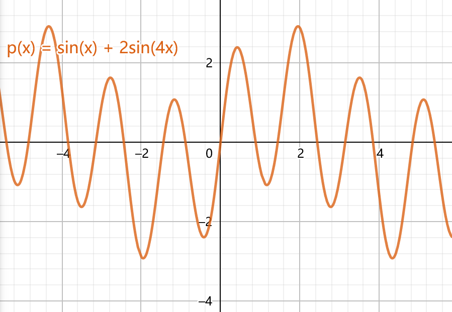

Going back to our object,

we would like to know more about this wave, that is its pitch components, their volume, etc. 
It is like unmixing a already mixed color, which sounds impossible. But fortunately, there IS a method, allowing us to complete this task.
And it is called the **Fourier Transform**.
$$
F\left(\omega_{k}\right) \equiv \int_{-\infty}^{\infty} f(t) e^{-2 \pi i k t} \mathrm{~d} t, \quad k \in(-\infty, \infty)
$$
Intuitively, this method winds the wave around in circular ways, 
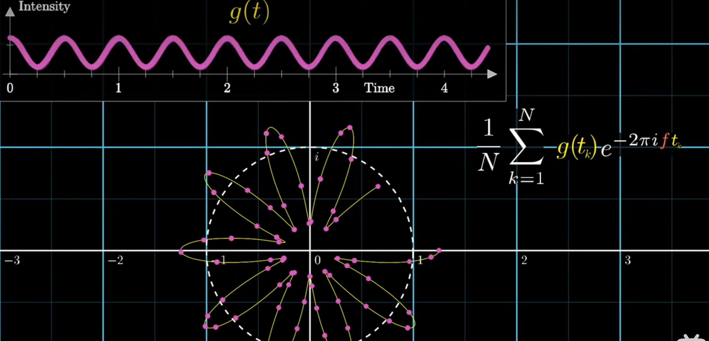

then traces ***the center of mass*** of the resultant graph.

If we record all results of winding frequency about the position of CM, we get the graph for **frequency domain**.


The only thing to be noticed is that, when winding the wave in a frequency that is just a frequency component of the original wave, we meet with a peak. And the height of the peak is the strenth or volume of that component. 
Thus reading about where the peaks arise, we know almost every thing we need about the original wave.

# Segment 2 DFT
If we continue to zoom in on the sound, we see these dots.
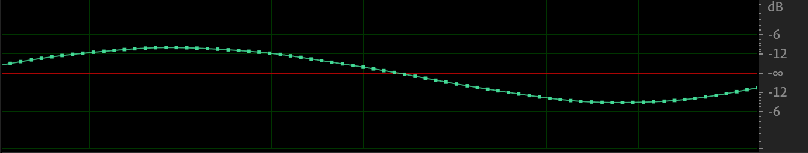
So in computer, this is how we store the audio. So in real application, we require the discrete version of Fourier Transform.
$$
\hat{f}_{k}=\sum_{j=0}^{n-1} f_{j} e^{-i 2 \pi j k / n}
$$
$$
\left[\begin{array}{c}
\hat{f}_{0} \\
\hat{f}_{1} \\
\hat{f}_{2} \\
\vdots \\
\hat{\hat{f}}_{n-1}
\end{array}\right]=\left[\begin{array}{ccccc}
1 & 1 & 1 & \cdots & 1 \\
1 & w_{n} & \omega_{n}^{2} & \cdots & w_{n}^{n-1} \\
1 & w_{n}^{2} & w_{n}^{4} & \cdots & w_{n}^{2(n-1)} \\
\vdots & \vdots & 1 & \cdots & \vdots \\
1 & w_{n-1}^{n-1} & w_{n}^{2(n-1)} & \cdots & w_{n}^{(n-1)^{2}}
\end{array}\right]\left[\begin{array}{l}
f_{0} \\
f_{1} \\
f_{2} \\
\vdots \\
\vdots \\
f_{n-1}
\end{array}\right]
$$

$$
\omega_{n}=e^{-2 \pi i / n}
$$
```
Animation on one segment to explain the indexes:
```
And this is basically what we obtain, a discrete graph of frequency domain
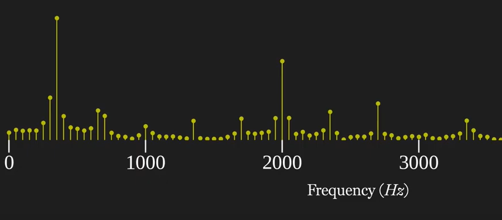
# Segment 3: STFT
So far, we have just discussed what we do on a specific time. Now we would like to repeat this process along the time.
For example, at t=0.1s
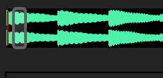
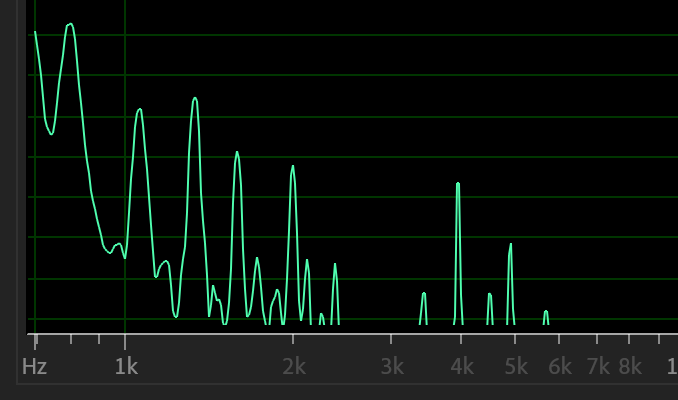
t=0.2s,
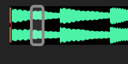
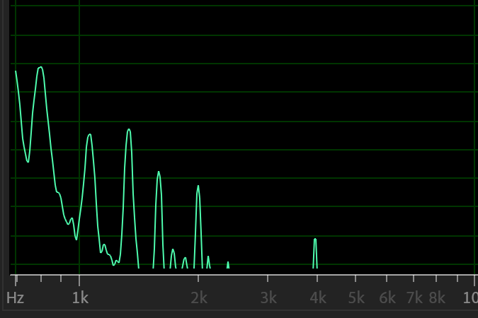

This add perspective w.r.t time

Notice that if we take the Fourier transform of the whole audio, we're going to extract a lot of frequencies. However, we do not know when these frequencies occur.

But through windows of segments, we kind of filter out the current frequencies from that of all the frequencies.

This can also be seen in the spectrogram
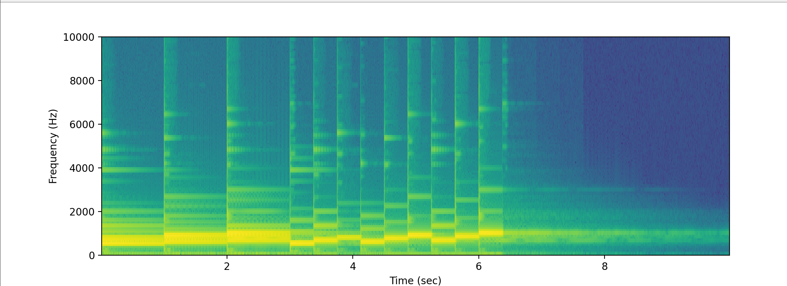

The height of the frequency domain graph is represented here by the brightness (or color) at a time.