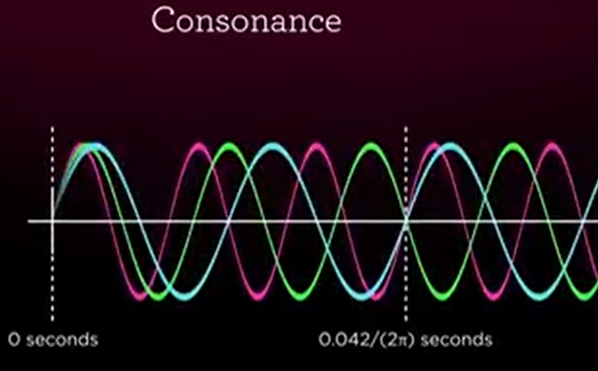
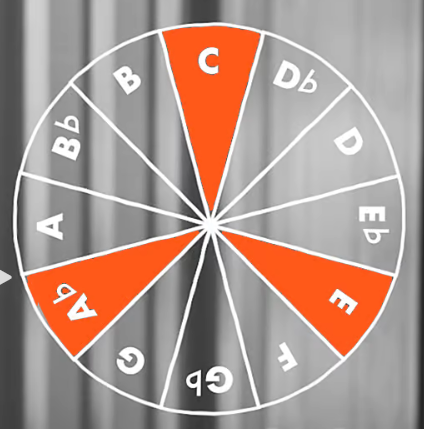

# Summary
## Music part
### Tonality (long section)
+  大调欢快，小调忧伤; D调忧伤...
+ 
+ Reference: https://dmitri.mycpanel.princeton.edu/

==旋律？？==同样的旋律顺序1576在调内移动

### Chord, Consonance (short section)
#### Triad 大调小调
  
#### Special chords, specific feelings
 
  Reference: Cheng P5, **Fractions**
  https://www.wfmt.com/math-in-music?v=fractions-give-us-feelings
### Sym, Fractal, Bach
+ Sym: M, W. Bach. G major
+ Fractal: 慢速版本，交响
### Harmonics
音色不同，细节的波动

## Mathematical tool                                        